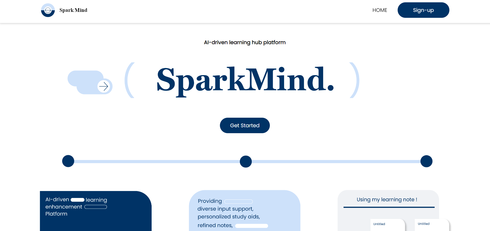

<a href="https://sparkmind.vercel.app/">
  <h1 align="center">SparkMind</h1>
  
</a>

<p align="center">
 AI-driven learning hub platform
</p>

<p align="center">
  <a href="#team"><strong>Team</strong></a> ·
  <a href="#features"><strong>Features</strong></a> ·
  <a href="#demo"><strong>Demo</strong></a> ·
  <a href="#getting-started"><strong>Getting Started</strong></a> ·
  <a href="#feedback-and-issues"><strong>Feedback and Issues</strong></a>
</p>

## Team

- [Seokyung Kim](https://github.com/lluciiiia)
- [Krishna Dharsandia](https://github.com/KRISHNA-DHARSANDIA)
- [Mike Odnis](https://github.com/WomB0ComB0)
- [Lovinson Dieujuste](https://github.com/Wisesofthemall)
- [Hyejin Kim](https://linkedin.com/in/hyejin-kim-57177b321/)

## Features

- **Web Scraper**
  - Extract content from any URL for learning purposes.
  - AI-powered content analysis and study guide generation.

- **Diverse Learning Material Input Support**
  - Accepts various types of input: Video, Text, Keywords, and Topics.

- **AI-Generated Study Materials**
  - **Summary**: Concise summaries of learning materials.
  - **Video Recommendations**: Relevant videos for deeper understanding.
  - **Q&A**: Exercise questions to reinforce concepts.
  - **Further Information**: Additional resources for comprehensive learning.
  - **Action Items**: Task identification and integration with Google Calendar and Gmail.

- **Smart Note Taking**
  - **Grammar Refinement**: Automatic correction of grammatical errors.
  - **Concise Version**: Summarization of lengthy or disorganized notes.

- **AI-Powered Discussion**
  - Engage in interactive discussions with AI to enhance comprehension.
  - AI-generated recommended questions based on user input.

- **Extended Learning Materials**
  - Seamless integration of new inputs with existing materials for comprehensive study support.

- **Learning History**
  - Track and review all learning activities and materials.

## Demo

Watch our fully working demo on [YouTube](https://youtu.be/MJtmCqJjejw?si=j9s7jFL7Lc4eXv8B).

## Getting Started

1. Create a Supabase project via the [Supabase dashboard](https://database.new).

2. Clone the repository:

   ```bash
   git clone https://github.com/your-username/sparkmind.git
   cd sparkmind
   ```

3. Install dependencies:

   ```bash
   npm install
   ```

4. Set up environment variables:
   - Copy `.env.local.example` to `.env.local`
   - Update the following in `.env.local`:

     ```
     NEXT_PUBLIC_SUPABASE_URL=[INSERT SUPABASE PROJECT URL]
     NEXT_PUBLIC_SUPABASE_ANON_KEY=[INSERT SUPABASE PROJECT API ANON KEY]
     ```

   - Find these values in [your Supabase project's API settings](https://app.supabase.com/project/_/settings/api)

5. Run the development server:

   ```bash
   npm run dev
   ```

   Visit [http://localhost:3000](http://localhost:3000) to see the application.

## Feedback and Issues

We welcome your feedback and contributions! Please open an issue or submit a pull request on our [GitHub repository](https://github.com/your-username/sparkmind).

## License

This project is licensed under the [MIT License](LICENSE).
